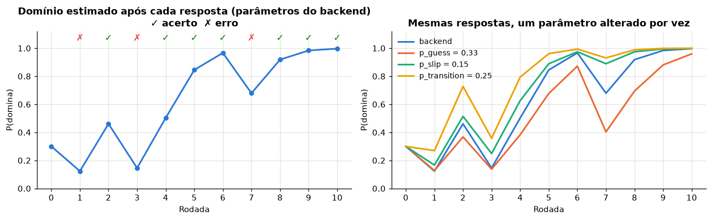
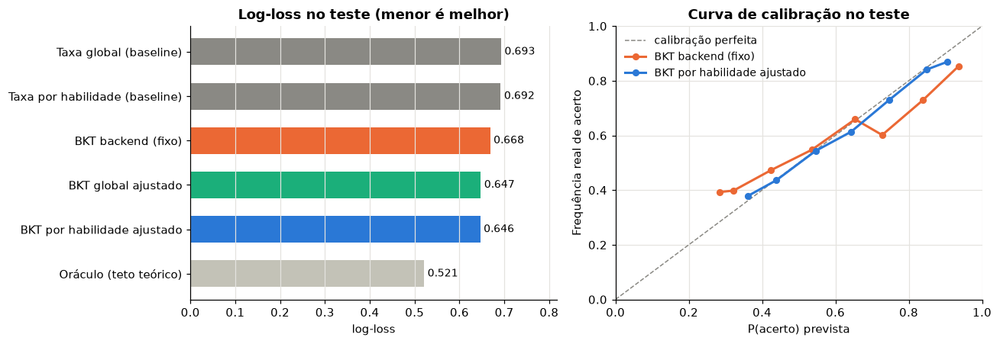
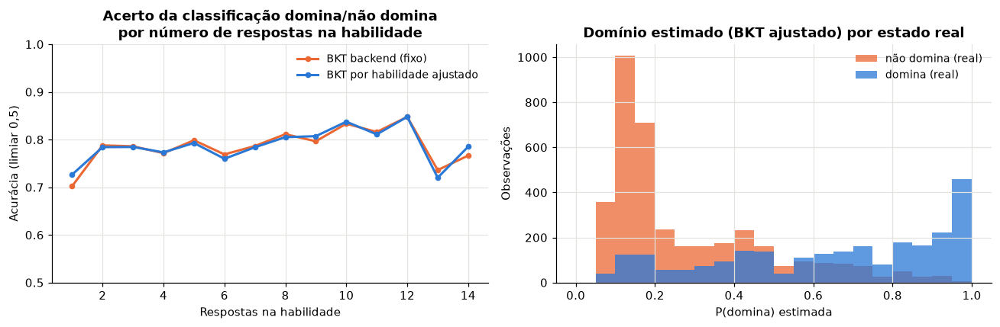

# Relatório Técnico: Modelo de IA do Fake News Fact Checker

**Bayesian Knowledge Tracing (BKT) para estimar o domínio de habilidades de checagem de notícias**

Residência em IA (ELD/UnB), Turma 1. Primeiro desafio, entrega do modelo. Data: 09/10/2026.

---

## Resumo

O Fake News Fact Checker é um jogo em que o jogador analisa notícias e responde a perguntas de múltipla escolha. Cada pergunta exercita uma de quatro habilidades:

- `SOURCE`: fonte;
- `EVIDENCE`: evidências;
- `CONTEXT`: contexto;
- `VISUAL`: imagem.

O componente de IA é um **Bayesian Knowledge Tracing (BKT)**. A cada resposta, ele atualiza a probabilidade de o jogador dominar a habilidade exercitada. Essa probabilidade aparece no perfil do jogador e orienta o seletor adaptativo, que escolhe a próxima pergunta na habilidade mais fraca.

Nesta entrega:

1. explicamos o funcionamento do modelo;
2. construímos um pipeline de calibração por máxima verossimilhança, com um conjunto de parâmetros por habilidade;
3. avaliamos o modelo contra baselines, contra os parâmetros fixos usados hoje no backend e contra um teto teórico;
4. salvamos o modelo calibrado em `.pkl`.

Como ainda não há histórico real de jogadores (o banco tem 10 respostas de teste), a calibração e a avaliação usam uma **base simulada** gerada pelo próprio processo do BKT e pelo seletor adaptativo do backend. Os números validam o método, não o comportamento de jogadores reais.

**Principais resultados (teste com 240 jogadores nunca vistos, 6.270 respostas):**

| Modelo | AUC | Log-loss | Brier |
|---|---|---|---|
| Taxa global de acerto (baseline) | 0,500 | 0,693 | 0,250 |
| BKT com parâmetros fixos do backend | 0,654 | 0,668 | 0,236 |
| **BKT calibrado por habilidade (proposto)** | **0,659** | **0,646** | **0,228** |
| Oráculo que conhece o estado verdadeiro (teto teórico) | 0,762 | 0,521 | 0,173 |

O domínio estimado separa bem quem domina de quem não domina (AUC ≈ 0,84 contra o estado latente verdadeiro). O principal achado prático é que o `p_guess = 0,20` do backend está mal calibrado para perguntas de 3 alternativas. Trocá-lo por ≈ 1/3 recupera quase todo o ganho da calibração completa.

---

## 1. Artefatos entregues

| Caminho | Conteúdo |
|---|---|
| `notebooks/bkt_modelo.ipynb` | Notebook executado: teoria, carga dos dados, treino, avaliação, persistência e uso do modelo |
| `modelos/bkt_modelo.pkl` | Modelo treinado: parâmetros por habilidade, métricas e metadados de proveniência |
| `src/bkt_engine.py` | Motor BKT; cópia idêntica, linha a linha, de `backend/app/bkt/engine.py` |
| `dados/respostas_teste_local.csv` | As 10 respostas reais existentes, sem identificação de usuário |
| `figuras/` | Gráficos gerados pelo notebook |
| `requirements.txt` | Dependências para executar o notebook |

Para executar, rode `pip install -r requirements.txt` e depois abra `notebooks/bkt_modelo.ipynb` e execute todas as células. A execução completa leva menos de 15 segundos e é determinística (seed fixa).

---

## 2. Como o modelo funciona

### 2.1 Ideia central

O BKT (Corbett & Anderson, 1995) trata o conhecimento de uma habilidade como um **estado oculto** com dois valores: o jogador **domina** ou **ainda não domina** a habilidade. Não é possível observar esse estado diretamente. Observa-se apenas se cada resposta foi **certa ou errada**. Formalmente, é um Modelo Oculto de Markov com dois estados e duas observações, definido por quatro probabilidades:

| Parâmetro | Significado | Interpretação no jogo |
|---|---|---|
| `p_init`, P(L₀) | já domina antes da primeira pergunta | conhecimento prévio |
| `p_transition`, P(T) | passa de "não domina" para "domina" após uma rodada | aprendizado com a explicação mostrada ao fim de cada rodada |
| `p_guess`, P(G) | acerta **sem** dominar | chute; com 3 alternativas, o chute puro acerta ≈ 1/3 das vezes |
| `p_slip`, P(S) | erra **mesmo** dominando | desatenção, pressa, erro de clique |

O modelo não prevê "esquecimento": quem passou a dominar continua dominando.

### 2.2 O que acontece a cada resposta

Seja P(L) a probabilidade atual de domínio, guardada no banco (`UserSkillState.mastery_probability`, que começa em 0,30).

**Passo 0: previsão.** Antes de ver a resposta, o modelo sabe qual é a chance de acerto:

```
P(acerto) = P(L)·(1 − P(S)) + (1 − P(L))·P(G)
```

**Passo 1: observação (regra de Bayes).** A resposta é evidência sobre o estado oculto:

```
se acertou:  P(L | acerto) = P(L)·(1 − P(S)) / [ P(L)·(1 − P(S)) + (1 − P(L))·P(G) ]
se errou:    P(L | erro)   = P(L)·P(S)       / [ P(L)·P(S)       + (1 − P(L))·(1 − P(G)) ]
```

**Passo 2: transição (aprendizagem).** Depois da rodada, quem ainda não dominava pode ter aprendido:

```
P(L)novo = P(L | obs) + (1 − P(L | obs))·P(T)
```

**Exemplo com os parâmetros do backend** (`p_guess = 0,20`, `p_slip = 0,05`, `p_transition = 0,10`), para um jogador com P(L) = 0,30 que acerta:

- observação: 0,30·0,95 / (0,30·0,95 + 0,70·0,20) = 0,285 / 0,425 = **0,671**;
- transição: 0,671 + 0,329·0,10 = **0,704**.

Se ele tivesse errado, o domínio cairia para **0,124**.

Os parâmetros controlam o quanto cada resposta pesa:

- `p_guess` alto faz um acerto valer pouco ("pode ter sido chute").
- `p_slip` baixo faz um erro pesar muito ("quem domina quase nunca erra").
- `p_transition` faz o domínio crescer a cada rodada, mesmo com erro.



### 2.3 Onde o modelo está no sistema

O fluxo é `Answer → BKTManager → SkillTracker → BKTEngine → UserSkillState → QuestionSelector`:

1. `AnswerService.process_answer` corrige a resposta.
2. `BKTManager.update(skill, domínio, correta)` encaminha para o tracker da habilidade (`SourceTracker`, `EvidenceTracker`, `ContextTracker`, `VisualTracker`).
3. Cada tracker chama o `BKTEngine` com seus parâmetros.
4. O novo domínio é gravado na mesma transação da resposta.
5. O `QuestionSelector` escolhe a próxima pergunta na habilidade de menor domínio, com dificuldade mais próxima desse domínio e evitando repetir notícias.

O `BKTEngine` é puro: não tem estado e não depende de banco nem de API. Por isso o notebook importa exatamente o mesmo código usado em produção.

---

## 3. Critérios para a escolha da abordagem

O projeto passou por duas abordagens.

**Primeira versão: perfil por questionário com clustering (GMM/K-Means).**
- **Como funcionava:** o usuário respondia 8 perguntas de opinião (escala 1–5) e um Gaussian Mixture o classificava em 6 perfis comportamentais, como "Crente resistente" ou "Compartilhador impulsivo".
- **Por que foi abandonada:**
  - O modelo era treinado com respostas sintéticas geradas a partir de médias que a própria equipe definiu. Na prática, o clustering reencontrava os perfis que nós mesmos inventamos.
  - O perfil era estático. Classificar alguém não ajuda a pessoa a melhorar.
  - Não havia rótulo nem critério externo para validar os perfis.
  - O perfil descrevia atitudes declaradas, não o desempenho real na tarefa de checar notícias.

**Abordagem atual: jogo adaptativo com rastreamento de conhecimento (BKT).** O produto passou a medir **habilidades** observáveis em respostas certas ou erradas, e não traços de personalidade. Para isso, comparamos as alternativas de *knowledge tracing*:

| Critério | BKT | IRT / Elo | Deep Knowledge Tracing (LSTM) | Regra simples (% de acertos) |
|---|---|---|---|---|
| Funciona com poucos dados por jogador | ✔ | ✔ | ✘ (precisa de milhares de sequências) | ✔ |
| Funciona sem dados de treino (com parâmetros iniciais razoáveis) | ✔ | parcial | ✘ | ✔ |
| Modela aprendizagem durante o jogo | ✔ (`p_transition`) | parcial (Elo) | ✔ | ✘ |
| Trata chute e deslize explicitamente | ✔ | ✘ | implícito | ✘ |
| Interpretável (parâmetros com significado pedagógico) | ✔ | ✔ | ✘ | ✔ |
| Saída por habilidade, em probabilidade, pronta para o seletor | ✔ | parcial | parcial | ✘ (não é probabilidade de domínio) |
| Atualização online, O(1) por resposta | ✔ | ✔ | ✘ (inferência de rede) | ✔ |

O BKT foi escolhido por ser o único que atende a todos os critérios na nossa situação. A situação é esta:

- não há histórico de jogadores;
- as sessões são curtas (10 rodadas);
- precisamos explicar a avaliadores e usuários o que o número significa;
- a arquitetura pede um módulo matemático isolado, testável por testes unitários.

Também decidimos manter **um conjunto de parâmetros por habilidade**, com um tracker por skill, porque é razoável esperar que analisar uma imagem seja mais difícil e mais lento de aprender do que analisar uma fonte.

---

## 4. Preparação dos dados e treinamento

### 4.1 Dados disponíveis

- **Bases da análise exploratória (`EDA/datasets/`):** notícias rotuladas como falsas ou verdadeiras. Foram úteis para entender temas e padrões das fake news e para inspirar o conteúdo das perguntas. Não são dados de jogadores, então não servem para treinar o BKT, que precisa de sequências `(jogador, habilidade, acertou?, data)`.
- **Banco do backend:** 12 perguntas (3 por habilidade, todas com 3 alternativas) e 10 respostas de um usuário de teste. Exportamos essas respostas sem identificação. Elas são usadas para demonstrar a execução, mas são insuficientes para estimar 16 parâmetros.

### 4.2 Base simulada

Para validar o pipeline de ponta a ponta, geramos uma base sintética que reproduz o funcionamento do jogo:

- **Jogadores e partidas:** 800 jogadores, cada um com 1 a 4 partidas de 10 rodadas, num total de 20.150 respostas.
- **Seleção da pergunta:** em cada rodada, a habilidade é escolhida **como no backend**: a de menor domínio estimado pelo BKT de produção, com empate resolvido pela ordem `SOURCE, EVIDENCE, CONTEXT, VISUAL`.
- **Resposta:** é sorteada a partir do **estado latente verdadeiro** do jogador. Depois de cada rodada, ele pode aprender.
- **Parâmetros "verdadeiros"** (hipóteses da equipe, a validar com dados reais):

| Habilidade | `p_init` | `p_guess` | `p_slip` | `p_transition` | Justificativa |
|---|---|---|---|---|---|
| SOURCE | 0,35 | 0,33 | 0,08 | 0,15 | a habilidade mais intuitiva |
| EVIDENCE | 0,25 | 0,30 | 0,10 | 0,12 | |
| CONTEXT | 0,20 | 0,33 | 0,10 | 0,10 | |
| VISUAL | 0,15 | 0,30 | 0,12 | 0,08 | imagem fora de contexto é a menos intuitiva |

`p_guess` ≈ 1/3 reflete as 3 alternativas das perguntas.

A simulação tem duas vantagens:

1. Podemos verificar se o treino **recupera** os parâmetros que geraram os dados.
2. Podemos medir a qualidade do domínio estimado contra o **estado verdadeiro**, o que nunca é possível com dados reais.

### 4.3 Preparação

- **Ordenação:** as respostas são agrupadas por jogador × habilidade e ordenadas cronologicamente, porque o BKT depende da ordem.
- **Vetorização:** as sequências viram matrizes 0/1 com máscara de posições válidas, e o filtro do BKT roda vetorizado sobre todas as sequências ao mesmo tempo. Verificamos que esse filtro produz **exatamente** os mesmos valores que o `BKTEngine` do backend (diferença < 10⁻¹²).
- **Divisão treino/teste por jogador (70/30, `GroupShuffleSplit`):** todas as respostas de um jogador ficam do mesmo lado. O teste mede a generalização para **jogadores novos**, que é o uso real, sem vazamento entre treino e teste.
- **Robustez:** validação cruzada adicional em 5 *folds* agrupados por jogador (`GroupKFold`).

### 4.4 Treinamento

"Treinar" o BKT significa escolher os quatro parâmetros de cada habilidade que **maximizam a verossimilhança** das sequências observadas. A verossimilhança vem do algoritmo *forward*: em cada passo, prevê-se P(acerto) e depois atualiza-se o domínio com a resposta. É a mesma conta que o jogo faz online. Decisões tomadas:

- **Otimizador:** L-BFGS-B com limites.
- **Restrição `p_guess`, `p_slip` < 0,5:** sem ela, o BKT admite soluções **degeneradas** em que errar passa a indicar domínio (Baker et al., 2008).
- **10 pontos de partida por habilidade:** a verossimilhança do BKT tem mínimos locais. O primeiro ponto é a configuração atual do backend; os demais são aleatórios.
- **Ajuste por habilidade e ajuste global:** além do ajuste por habilidade (o modelo proposto), ajustamos um conjunto global único, para medir o ganho de separar as habilidades.

Parâmetros obtidos no treino:

| Habilidade | `p_init` | `p_guess` | `p_slip` | `p_transition` |
|---|---|---|---|---|
| SOURCE | 0,366 | 0,315 | 0,095 | 0,155 |
| EVIDENCE | 0,256 | 0,292 | 0,087 | 0,119 |
| CONTEXT | 0,226 | 0,341 | 0,128 | 0,105 |
| VISUAL | 0,156 | 0,280 | 0,129 | 0,076 |
| *Backend atual (todas)* | *0,30* | *0,20* | *0,05* | *0,10* |

---

## 5. Métricas e análise dos resultados

### 5.1 Métricas escolhidas

O BKT produz duas saídas, e cada uma é avaliada separadamente.

**1. Previsão da próxima resposta, P(acerto)**, prevista antes de ver cada resposta do conjunto de teste:

- **AUC-ROC**: o modelo dá probabilidade maior a quem acerta do que a quem erra? Não depende de limiar.
- **Log-loss e Brier**: as probabilidades estão **calibradas**? Isso é essencial, porque o número é exibido ao jogador e guia o seletor.
- **Acurácia @0,5**: apenas como referência intuitiva.

**2. Domínio estimado, P(L)**, comparado ao estado latente verdadeiro (disponível só na simulação):

- AUC e Brier do domínio;
- precisão e revocação da decisão "domina", com limiar 0,95, o usual na literatura de BKT.

**Comparações:**

- dois baselines sem histórico: a taxa de acerto global e a taxa por habilidade;
- o BKT com os valores fixos do backend;
- o BKT calibrado global;
- o BKT calibrado por habilidade;
- um **oráculo** que conhece o estado verdadeiro, usado como teto teórico.

### 5.2 Previsão da próxima resposta (teste)

| Modelo | AUC | Log-loss | Brier | Acurácia@0,5 |
|---|---|---|---|---|
| Taxa global (baseline) | 0,500 | 0,693 | 0,250 | 0,515 |
| Taxa por habilidade (baseline) | 0,531 | 0,692 | 0,249 | 0,527 |
| BKT backend (fixo) | 0,654 | 0,668 | 0,236 | 0,616 |
| BKT global calibrado | 0,655 | 0,647 | 0,228 | 0,617 |
| **BKT por habilidade calibrado** | **0,659** | **0,646** | **0,228** | **0,617** |
| Oráculo (teto teórico) | 0,762 | 0,521 | 0,173 | 0,757 |



**Análise:**

- **O histórico importa.** Todos os BKTs superam claramente os baselines (AUC de 0,50 para ≈ 0,66).
- **O teto é baixo.** Mesmo o oráculo, que conhece o estado verdadeiro, só chega a AUC 0,76. Com 3 alternativas, um terço de quem não domina acerta por chute, e quem domina erra cerca de 10% das vezes. A resposta individual é ruidosa por natureza. O BKT calibrado percorre ≈ 60% do caminho entre o acaso e esse teto. O restante é o preço de não observar o estado e de ter poucas respostas por habilidade.
- **A diferença entre o backend e o calibrado está na calibração, não na ordenação.**
  - Onde o modelo atual prevê ≈ 28% de acerto, a taxa real é ≈ 39%.
  - Onde prevê ≈ 93%, a taxa real é ≈ 85%.
  - O modelo calibrado acompanha a diagonal.
- **O ganho de separar por habilidade é pequeno nesta simulação.** O que mais pesa é corrigir `p_guess` e `p_slip`.
- **O resultado se repete na validação cruzada (5 folds):**
  - log-loss de 0,642 ± 0,006 (calibrado) contra 0,664 ± 0,008 (backend);
  - AUC de 0,665 ± 0,010 contra 0,656 ± 0,012;
  - o calibrado vence nas duas métricas **em todos os 5 folds**.

### 5.3 O domínio exibido reflete o estado real?

| Modelo | AUC domínio | Precisão "domina" | Revocação "domina" | % declarado "domina" |
|---|---|---|---|---|
| BKT backend (fixo) | 0,837 | 0,934 | 0,323 | 13,9% |
| BKT por habilidade calibrado | 0,841 | 0,985 | 0,182 | 7,4% |

(No teste, 40,3% das observações estão de fato no estado "domina".)



**Análise:**

- **O domínio estimado ordena bem os jogadores** (AUC ≈ 0,84).
- **No limiar de 0,95 há um trade-off.**
  - O modelo calibrado quase nunca declara domínio por engano (precisão 0,985), mas é conservador: reconhece só ≈ 18% de quem realmente domina.
  - O backend declara domínio com o dobro da frequência, com mais falsos positivos. Isso acontece porque um único acerto já o leva de 0,30 para 0,70.
  - Num jogo educativo, dizer a alguém que ele domina uma habilidade quando não domina é o erro mais caro. Por isso preferimos o comportamento do modelo calibrado, e o limiar pode ser ajustado como regra de produto.
- **A classificação domina/não domina melhora pouco depois da 2ª resposta.**
  - Ela acerta ≈ 70–73% na 1ª resposta e ≈ 78% a partir da 2ª. Depois disso fica estável, por causa do ruído de chute e deslize.
  - Com o banco atual de 3 perguntas por habilidade, cerca de 1 em cada 5 classificações ainda está errada.

### 5.4 Recuperação dos parâmetros

Nos 5 folds, os parâmetros estimados ficaram em média a **0,01** dos verdadeiros, com desvio-padrão entre folds ≤ 0,016. O procedimento de treino é correto e estável: com dados gerados por um BKT, ele encontra o BKT que os gerou.

### 5.5 Sensibilidade ao `p_guess`

Variamos apenas o `p_guess` do backend, mantendo os demais parâmetros fixos:

| `p_guess` | Log-loss (teste) | Precisão "domina" | Domínio após 1 acerto (partindo de 0,30) |
|---|---|---|---|
| 0,10 | 0,719 | 0,879 | 0,82 |
| **0,20 (atual)** | **0,668** | **0,934** | **0,70** |
| 0,30 | 0,652 | 0,980 | 0,62 |
| **0,333** | **0,652** | **0,985** | **0,59** |
| 0,40 | 0,659 | 0,992 | 0,55 |

O ótimo está em ≈ 1/3, coerente com as 3 alternativas. **Recomendação imediata:** ajustar `P_GUESS` dos quatro trackers para 0,33. É uma mudança de uma linha por tracker, que captura quase todo o ganho da calibração completa.

### 5.6 Execução nos dados reais disponíveis

Com as 10 respostas reais, as sequências por habilidade foram:

- SOURCE ✓✗✗
- EVIDENCE ✓✗✗
- CONTEXT ✓
- VISUAL ✗✓✗

Com o modelo do backend, o domínio final em CONTEXT é **0,70**, depois de um único acerto. Com o modelo calibrado, que trata parte dos acertos como possível chute, é **0,49**. Este caso resume a diferença entre os dois modelos.

---

## 6. Principais desafios

1. **Mudança de abordagem no meio do desafio.**
   - O modelo inicial (GMM/K-Means sobre questionário) chegou a ser implementado, treinado e integrado ao backend.
   - Ao percebermos que ele apenas reencontrava perfis sintéticos definidos por nós e que não ajudava o usuário a melhorar, migramos para o jogo com BKT.
   - O módulo de perfil foi removido do backend, e a documentação e o notebook anteriores ficaram desatualizados. Esta entrega os substitui.
2. **Falta de dados reais de jogadores.**
   - As bases públicas disponíveis são de notícias, não de interações de aprendizes, e o jogo ainda não tem usuários.
   - Por isso desenhamos uma simulação fiel ao fluxo do backend, com o seletor adaptativo incluído.
   - Também deixamos explícito, no notebook e no `.pkl` (`is_synthetic: True`), que os parâmetros calibrados vêm de dados sintéticos.
3. **Um erro sutil na primeira versão do motor BKT.**
   - A primeira implementação aplicava a transição **antes** da observação, com a fórmula `P(L)·(1 − T) + (1 − P(L))·T`. Ela permite que quem domina "desaprenda" com probabilidade T.
   - A correção passou a seguir a formulação padrão: primeiro Bayes, depois aprendizagem, sem esquecimento.
   - O caso virou teste unitário: `update(0,30, acerto) = 0,7035`.
4. **Parâmetros definidos sem calibração.**
   - Os valores do backend (0,30 / 0,20 / 0,05 / 0,10) são valores típicos da literatura, iguais para as quatro habilidades.
   - Só ao montar a avaliação percebemos que `p_guess = 0,20` pressupõe 5 alternativas, enquanto o jogo usa 3.
5. **Avaliar um modelo de variável latente.**
   - Com dados reais, o "domínio verdadeiro" nunca é observado. Só se avalia a previsão da próxima resposta.
   - A simulação permitiu avaliar também o domínio. Para interpretar uma AUC "baixa" (0,66), foi necessário construir um teto teórico (o oráculo).
6. **Identificabilidade e mínimos locais.** A verossimilhança do BKT admite soluções degeneradas e tem mínimos locais. Tratamos isso com limites nos parâmetros e múltiplos pontos de partida.
7. **Pouco conteúdo.** Com 12 perguntas e sem repetição, cada jogador responde no máximo 3 perguntas por habilidade, o que limita a precisão de qualquer modelo de domínio.

---

## 7. Aprendizados

- **Formular bem o problema vale mais que o algoritmo.** A virada de "classificar o usuário" para "medir e desenvolver habilidades" mudou o tipo de dado necessário, o modelo adequado e o que o produto entrega.
- **Modelos simples e interpretáveis são a escolha certa quando há pouco dado.** Quatro parâmetros com significado pedagógico permitiram raciocinar sobre o modelo, encontrar a má calibração de `p_guess` "no papel" e explicá-la.
- **Dados sintéticos validam o método, não o mundo.** A simulação foi essencial para testar o pipeline (recuperação de parâmetros, teto teórico). Também aprendemos a não vender seus números como desempenho real e a registrar essa limitação no próprio artefato.
- **A divisão treino/teste precisa respeitar a unidade de uso.** Separar por jogador, e não por resposta, evita vazamento e mede o que importa: o desempenho com jogadores novos.
- **Escolher métricas que respondam à pergunta.**
  - AUC sozinha diria que o modelo do backend e o calibrado são equivalentes.
  - Log-loss, Brier e a curva de calibração mostraram a diferença que afeta o jogador: probabilidades exageradas.
  - Precisão e revocação da decisão "domina" mostraram o trade-off de produto.
- **Comparar com baselines e com um teto.** Um número isolado (AUC = 0,66) não diz nada. Com a referência mínima (0,50) e a máxima (0,76), ele passa a ter interpretação.
- **Testes unitários sobre a matemática pegam erros que a interface não mostra.** O erro na ordem da atualização produzia números plausíveis na tela.

---

## 8. Limitações e próximos passos

1. **Calibrar com dados reais.** Coletar respostas reais (com consentimento) no formato `user_id, skill_code, correct, created_at` e reexecutar o notebook, que já aceita essa entrada sem mudanças estruturais.
2. **Ajustar `P_GUESS` para 0,33** nos trackers do backend, ou carregar os parâmetros do `.pkl` quando houver calibração com dados reais.
3. **Ampliar o banco de perguntas** para que cada habilidade tenha sequências mais longas (o domínio estabiliza a partir de 2 ou 3 respostas, mas a decisão "domina" no limiar de 0,95 exige mais).
4. **Considerar a dificuldade das perguntas no próprio modelo** (KT-IDEM, Pardos & Heffernan, 2011). Hoje a dificuldade é usada só pelo seletor.
5. **Considerar heterogeneidade entre jogadores** (BKT individualizado). A simulação assume que todos compartilham os mesmos parâmetros.

---

## Referências

- Corbett, A. T.; Anderson, J. R. (1995). Knowledge tracing: Modeling the acquisition of procedural knowledge. *User Modeling and User-Adapted Interaction*, 4(4), 253–278.
- Baker, R. S. J. d.; Corbett, A. T.; Aleven, V. (2008). More accurate student modeling through contextual estimation of slip and guess probabilities in Bayesian Knowledge Tracing. *ITS 2008*.
- Pardos, Z. A.; Heffernan, N. T. (2011). KT-IDEM: Introducing item difficulty to the Knowledge Tracing model. *UMAP 2011*.
- Piech, C. et al. (2015). Deep Knowledge Tracing. *NeurIPS 2015*.
